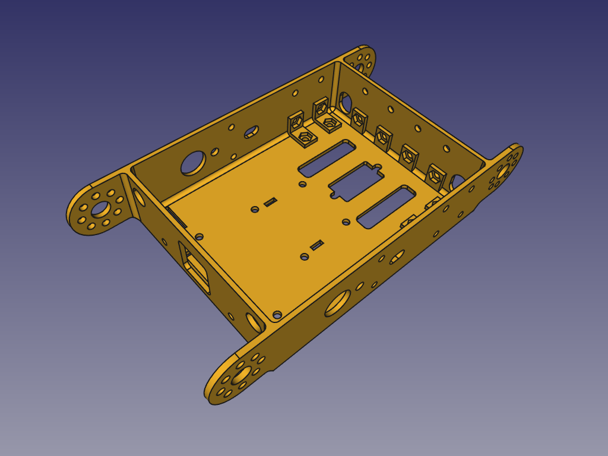
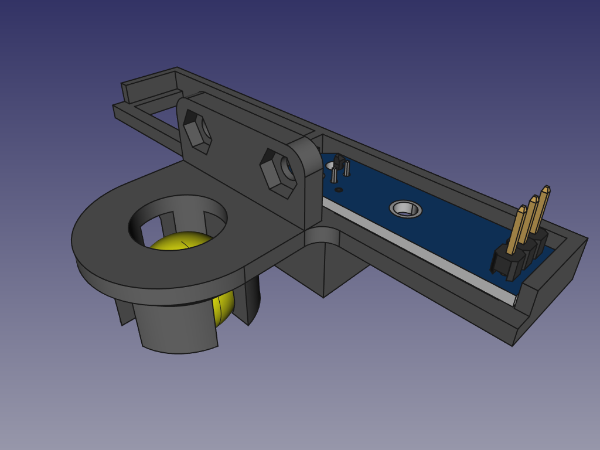
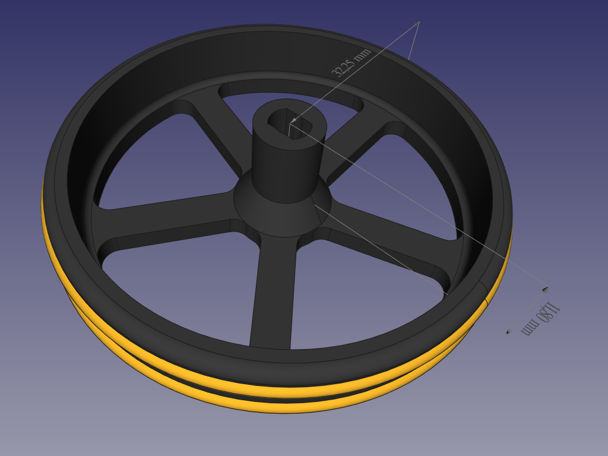
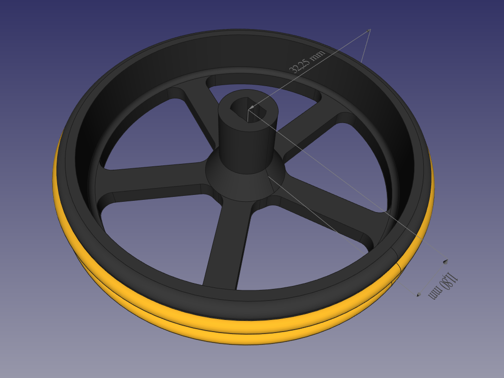
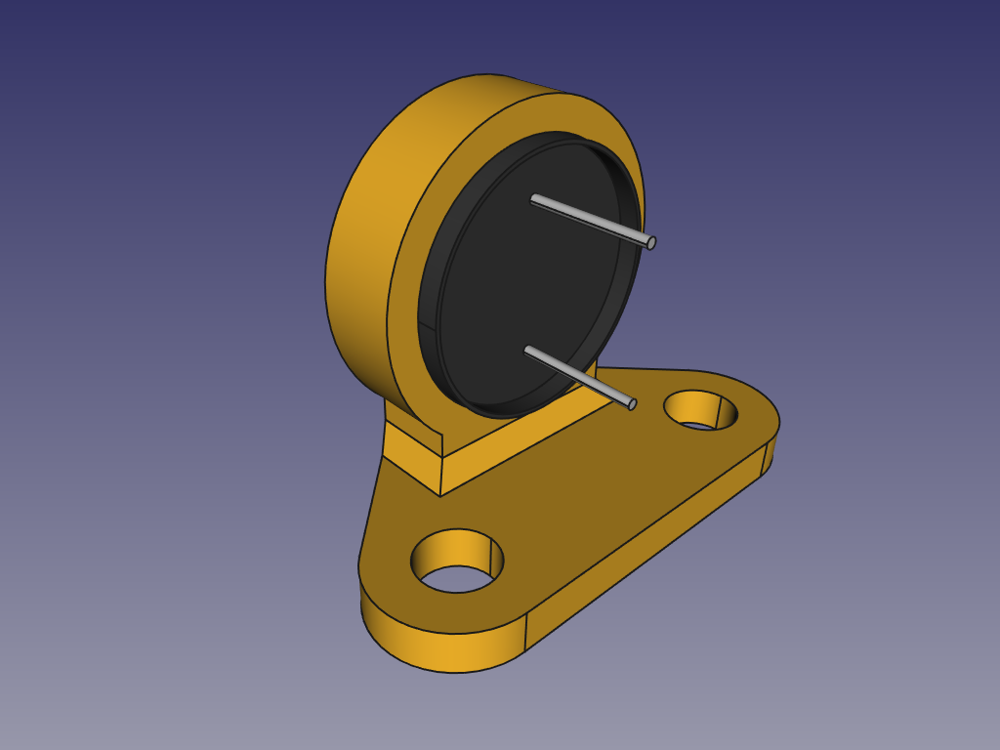
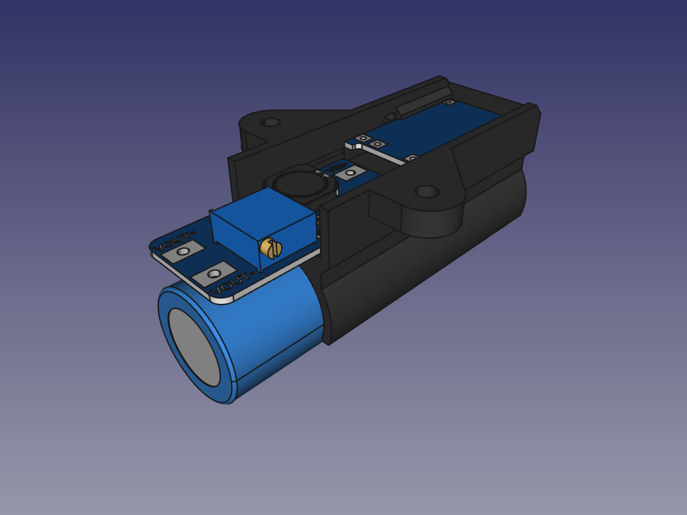

# Pezas 3D do mClon feitas en FreeCAD

## Chasis - v3

## Soporte para os sensores IR e a bola - v3

## Soporte para o sensor de ultrasons (simétrico) - v2

## Roda de 5 radios para xuntas tóricas de 2,5 mm

## Roda de 5 radios para xuntas tóricas de 3 mm

## Soporte para zumbador pasivo - v2

## PowerClon - v5
